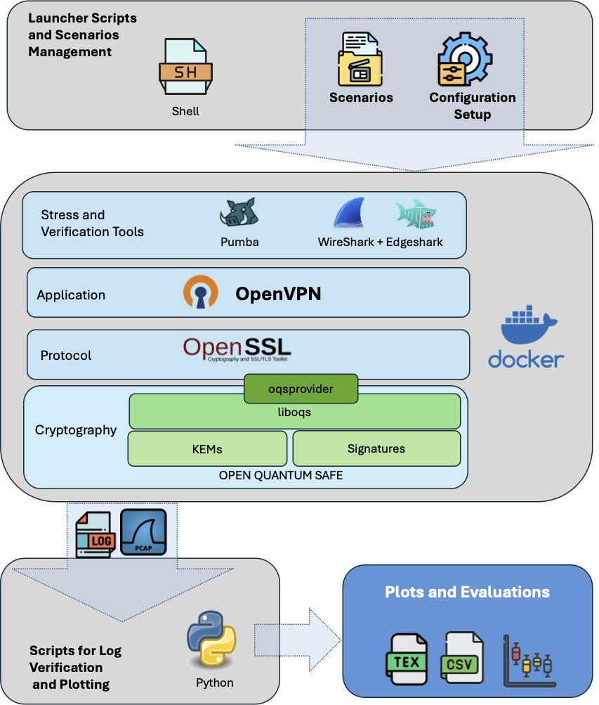

# 🐳 Post-Quantum TLS/VPN Test Framework

This framework provides a complete environment to test and benchmark the performance and compatibility of **TLS and VPN protocols (OpenVPN over OpenSSL)** using **classical, hybrid, and post-quantum cryptographic algorithms** inside Docker containers.

It supports multiple test scenarios, including primitive benchmarks, TLS handshakes, and full VPN setup with support for delay and packet loss using real network stress tools.

<p align="center"> <br>
  <em>Figure 1. Performance Evaluation Framework.</em>

</p>

---

## 🚀 Features

- 🔐 Benchmarking TLS/OpenVPN with traditional, hybrid, and post-quantum KEMs and signature algorithms.
- 🐳 Fully containerized with Docker.
- 📦 Includes support tools like **Pumba** (network emulation), **Wireshark** and **Edgeshark**.
- 📈 Automated logging, CSV export, and Python plotting.
- 📂 Modular scenario structure with per-test Launcher scripts.

---

## 📁 Project Structure


```bash

.
├── Applications/              # Pumba and other optional tools
├── Scenarios/                 # All test scenarios (TLS, VPN, etc.)
│   ├── 1-Primitives/
│   	└── Benchmarking of cryptographic primitives (baseline performance)
│   ├── 2-ltrace/ 				       
|		└── Executions with ltrace tools
│   ├── 3-HandshakeSignTraditional/
│   	└── TLS mutual handshake evaluation using traditional signature algorithms
|   ├── 4-HandshakeSignPostQuantum/
│   	└── TLS mutual handshake evaluation using post-quantum signature algorithms
│   ├── 5-CompareHandshakeTraditionalARMvsx86/
│   	└── Architecture comparison (ARM vs x86) for traditional TLS handshakes
│   ├── 6-CompareHandshakePostQuantumARMvsx86/
│   	└── Architecture comparison (ARM vs x86) for post-quantum TLS handshakes
│   ├── 7-VPNSignTraditional/
│   	└── OpenVPN connection establishment using traditional signatures
│   ├── 8-VPNSignPostQuantum/
│   	└── OpenVPN connection establishment using post-quantum signatures
│   ├── 9-CompareVPNSignTraditional/
│   	└── ARM vs x86 comparison for VPN with traditional signatures
│   ├── 10-CompareVPNSignPostQuantum/
│   	└── ARM vs x86 comparison for VPN with post-quantum signatures
│   ├── 11-VPNSignTraditionalLossDelays/
│   	└── VPN (traditional signatures) under packet loss and network delay
│   ├── 12-VPNSignPostQuantumLossDelays/
│   	└── VPN (post-quantum signatures) under packet loss and network delay
│   ├── 13-CompareVPNSignTraditionalDelays/
│   	└── Comparative analysis of VPN traditional signatures under delay
│   ├── 14-CompareVPNSignTraditionalLoss/
│   	└── Comparative analysis of VPN traditional signatures under packet loss
│   ├── 15-CompareVPNSignPQDelays/
│   	└── Comparative analysis of VPN post-quantum signatures under delay
│   ├── 16-CompareVPNSignPQLoss/
│   	└── Comparative analysis of VPN post-quantum signatures under packet loss
│
├── frameWork.sh
│   └── Main menu-driven launcher for building containers and running scenarios
│
└── README.md
```


## 📦 Requirements

- Docker (Linux/macOS/WSL)
- Python 3.8+
- Wireshark (for packet analysis)
- Pumba (included in `Applications/`)

---

## 🔧 Installation

```bash
git clone https://github.com/montenegro-montes/TLS-VPN.git
cd TLS-VPN
chmod +x frameWork.sh
```

---

## 🧪 How to Use

### Launch the menu:

```bash
./frameWork.sh
```

### Menu Overview:

```
╔════════════════════════════════════════╗
║      🐳  Docker & Protocol Menu        ║
╠════════════════════════════════════════╣
║ 1️⃣  Check installation                 ║
║ 2️⃣  Docker administration              ║
║ 3️⃣  Running Scenario                   ║
║ 4️⃣  Exit                               ║
╚════════════════════════════════════════╝
```

### Example Run:

1. Select `1️⃣ Check installation` to verify Docker, Pumba, Wireshark.
2. Select `2️⃣ Docker administration` to build and verify TLS/VPN containers.
3. Select `3️⃣ Running Scenario` to launch a full experiment (e.g., VPN handshake with ML-KEM).
4. Review logs and processed CSVs in each scenario's `Time/` subfolder.

---

## 📊 Results & Analysis

Processed logs and PCAPs are analyzed using Python scripts under `common_Process_scripts/`. Results are saved as:

- 📄 `*.csv`: Raw metrics
- 📈 Plots: Boxplots, performance graphs
- 📜 `*.tex`: LaTeX-ready result files

You can run analysis manually or via automation (`processAll.sh`).

---

## 🧠 Based On

- [OpenSSL + oqsprovider (Open Quantum Safe)](https://github.com/open-quantum-safe/openssl)
- [OpenVPN](https://openvpn.net/)
- [Pumba](https://github.com/alexei-led/pumba) — chaos testing
- Wireshark + TShark

---

## 📜 License

MIT License — feel free to use and modify for your research or experiments.

---
